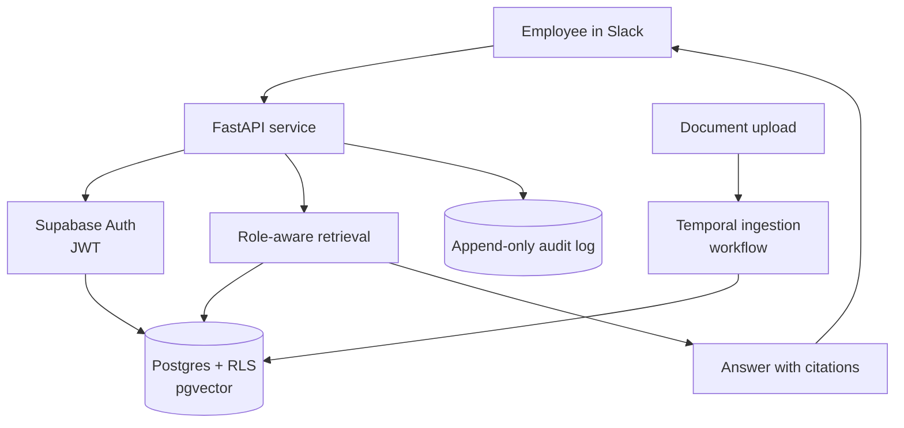

# Internal Knowledge Agent

> **Status: work in progress.** The data model, multi-tenant security layer and
> API scaffolding are in place. Retrieval, the Slack interface and billing are
> in progress. This README describes the full design and is honest about what is
> built versus planned (see [Status](#status)).

A multi-tenant SaaS where a company plugs in its internal documents and
employees ask questions in Slack, getting answers that are **role-aware**,
**cited**, and **fully audited**. The interesting engineering is underneath the
chat box: tenant isolation, retrieval, and auditability done at a level a real
company could trust.

## The problem

Most internal-knowledge tools either leak across teams (finance answers showing
up for someone who should not see them) or give confident answers with no
source. The two hard requirements that drive this whole design are:

1. **A user in one company, or one role, must never see another's data.**
2. **No source, no answer.** Every response cites the exact document section it
   came from, and unsupported answers are refused rather than hallucinated.

## Architecture

### Multi-tenant isolation through the database

Tenant and role isolation is enforced at the **database layer** with Postgres
Row-Level Security, not in application code. Supabase Auth issues a JWT whose
claims flow straight into RLS policies, so authentication and authorisation
share a single source of truth. The application cannot accidentally leak across
tenants, because the database itself refuses to return rows the caller is not
entitled to. This is the core design decision of the project: doing isolation
in app code is one missed `WHERE` clause away from a breach; doing it in RLS
makes the safe path the only path.

### Retrieval

Documents are chunked and embedded into **pgvector** (kept in Postgres rather
than a separate vector store, so the same RLS policies that protect rows also
protect embeddings). Retrieval is scoped by tenant and role before similarity
search runs, so a user only ever retrieves over documents they are allowed to
see. Answers are generated with citations back to the source chunk; if nothing
relevant is retrieved, the agent declines rather than guessing.

### Ingestion

Document ingestion (parse, chunk, embed, index) runs as a **Temporal** workflow
rather than an inline request handler, so a large upload cannot time out a web
request, and a failed step retries from where it stopped rather than re-running
the whole job.

### Auditability

Every query and administrative action writes to an **append-only audit log**,
enforced with Postgres triggers so rows cannot be updated or deleted even by the
service role. This is what makes the system defensible for a company that needs
to answer "who asked what, and what were they shown."

## Schema

Six tables: `tenants`, `users`, `documents`, `chunks`, `queries`, `audit_log`.
RLS is enabled on all of them; `audit_log` is append-only via triggers; `chunks`
holds the pgvector embeddings. Users map one-to-one onto Supabase auth users.

## Stack

Python, FastAPI, Postgres (Row-Level Security + pgvector), Supabase Auth,
Temporal, Claude, Next.js. Intended deployment on Railway with CI via GitHub
Actions and secrets managed outside the repo.

## Status

| Area | State |
|------|-------|
| Six-table schema + migrations | Built |
| RLS policies (tenant + role isolation) | Built |
| Supabase Auth → JWT → RLS wiring | Built |
| Append-only audit log (triggers) | Built |
| FastAPI service scaffolding | Built |
| Document ingestion (Temporal) | In progress |
| Retrieval + citations | In progress |
| Slack interface | Planned |
| Metered billing | Planned |
| Evaluation harness | Planned |

This is an active build, developed alongside client work, so it moves in bursts.
The foundations (the parts that are hard to retrofit, isolation and auditing)
were deliberately done first.

## Why it is built this way

The ordering is intentional. Multi-tenancy and audit logging are the things you
cannot bolt on safely later, so they came first, before the retrieval and chat
surface that are more visible but easier to add. The design favours pushing
security guarantees down into Postgres (RLS, triggers, pgvector in the same
database) rather than spreading them across application code, because a single
enforcement point is far easier to reason about and far harder to get wrong.

## License

MIT
